# SCQ-CFGRF(Initial title of the paper:"Data Augmentation for Bearing Fault Diagnosis Using a Novel Flow-Based Generative Model")

## 1.Copyright statement and update plan
### 1.1 Copyright statement and update plan
This code repository is the official code repository of paper "Data Augmentation for Bearing Fault Diagnosis Using a Novel Flow-Based Generative Model", and the account author is the original author of the paper and source code. The project's file usage instructions will be supplemented later.
The code files of this repository are still being uploaded recently, and the weight files will be considered to be uploaded to Google Cloud Drive due to their large size. If you reference this project, please inform us in the issue, thank you!(2025-3-23)
### 1.2 update
We have uploaded the weight files, which can be downloaded and used at the link. At the same time, each folder has a brief introduction, which can be seen in the Readme in each folder.(2025-3-25)

## 2.Weight file download link and instructions
###
To ensure the credibility of our paper, we decided to provide the pre-trained weight files of our model, and also to facilitate readers to directly complete image data synthesis by loading our weight files into the generator file.
Our model pre-trained weight files can be obtained from this link:
https://drive.google.com/drive/folders/1-nT8oyWBRETIntGGdyILk6AqfBFtFGXD?usp=drive_link
Replace the downloaded checkpoint folder with the downloaded checkpoint folder, and then load the corresponding .pth file in the folder in the generator to run and synthesize data.

## 3.Brief Instructions
### 3.1 dl.yaml
dl.yaml: This file contains all the environment configurations required for this project. You can use this file in conda to quickly deploy a virtual environment that can run our project.
### 3.2 config.yaml
config.yaml: This file contains the training and generation parameter configurations of the train.ipynb and generator.ipynb files, which can be adjusted according to your needs.
### 3.3 train.ipynb and generator.ipynb
train.ipynb: This file can be used to train your model, but the data needs to be adjusted to a level acceptable to the model.py and dataset folders. The specific resolution should be adjusted according to the individual device, and 32x32 pixel images are recommended.
generator.ipynb: This file is used to load and synthesize pre-trained files.

## 4.Abstracts of the papers to which this repository belongs
###
Bearings are vital in industrial machinery, making fault diagnosis a crucial research area. However, the rarity of fault conditions leads to highly imbalanced signal data, biasing traditional methods toward normal states. To address this, we propose SCQ-CFGRF, a novel classifier-free guidance Rectified Flow generative model that integrates a specially designed Residual Seaformer, a novel Continuous Wavelet Transform-based feature extractor, and a creative Quality Enhancer. Unlike existing methods, SCQ-CFGRF transforms raw time-domain signals into richer time-frequency representations while leveraging Rectified Flow for superior sample quality and inference efficiency. Our approach first converts 1D time-domain data into 2D time-frequency heatmaps via a novel CFEN-block. Simultaneously, Rectified Flow is constructed to extract high-dimensional features. These are processed by a UNet backbone embedded with our RS-block to enhance feature representation. Category labels and time steps are fused to establish conditional dependencies, improving global spatiotemporal perception and enabling classifier-free guidance. Finally, our trained model employs a sampler with a QE-block to refine sample quality and perform synthesis via the Euler method of Rectified Flow. Experiments on two real-world bearing datasets and ablation studies demonstrate SCQ-CFGRF’s superiority in synthesis quality and inference speed. Even under an extreme 1:400 class imbalance, it achieves 78.75\% to 81.15\% diagnostic accuracy, surpassing existing methods. 
###
The key contributions of this study are as follows:

(1) We propose a new SCQ-CFGRF method framework, which introduces Rectified Flow into the field of fault diagnosis data synthesis for the first time and achieves fast, stable and high-quality synthesis of fault data samples. Meanwhile, two real-world experiments and ablation experiments demonstrate the superiority of our method.

(2) In SCQ-CFGRF, in order to improve the signal feature extraction capability of the method framework, we specially designed a Continuous Wavelet Transform Feature Extraction Network block (CFEN-block). This block transforms the one-dimensional time domain signal into a two-dimensional time-frequency domain feature map through continuous wavelet transform and feature heat map formation, and then extracts various high-dimensional signal features through a deep learning network.

(3) In order to improve the quality and similarity of synthetic data, we embedded our newly designed Residual Seaformer block (RS-block) in the UNet backbone network of the method. According to the different levels in the network, they can be divided into RS1-block, RS2-block, and RS3-block. Through them, we can combine conditional and spatiotemporal information to improve the overall and detailed quality of synthetic data.

(4) We fuse conditional and time step information throughout the network to strengthen conditional dependencies and global spatiotemporal perception, enabling classifier-free guidance. Additionally, our newly designed Quality Enhancer block (QE-block) refines final samples using a Cosine Similarity-based enhancement mechanism, improving synthesis quality and efficiency.

###
In the future, we plan to test our method on additional industrial equipment, such as aircraft engines, chillers, and gearboxes. Moreover, we aim to explore its application in the financial sector for related research.

## 5.Recommended hardware equipment
CPU recommendation: i7-14650HX(Laptop)

GPU recommendation: RTX-4060(8GB)(Laptop)

Memory：32GB

Solid State Drive：1TB

It is recommended to use a higher configuration than this. The author's device uses shared memory to prevent out of GPU memory. It is recommended that readers use devices with more than 12GB of GPU memory to prevent program crashes or reduced model performance.

## 6.Schematic diagram of the structure of SCQ-CFGRF and the framework of the entire method

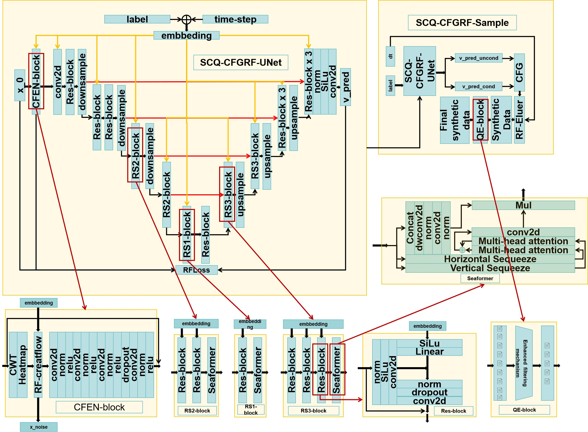
Fig.1 SCQ-CFGRF model and each block structure diagram.

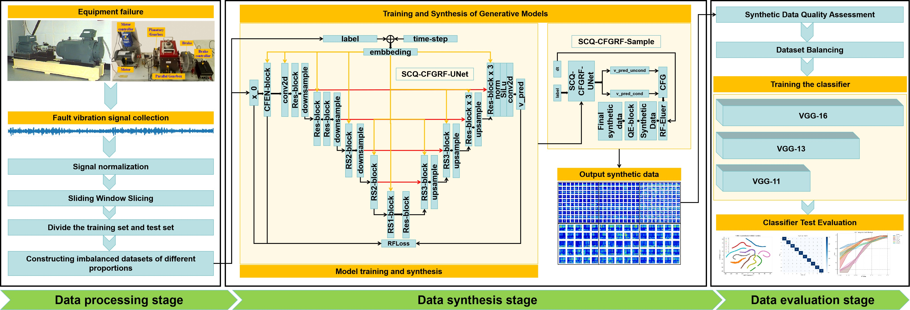
Fig.2 Proposed methodological framework.

## 7.Results Visualization

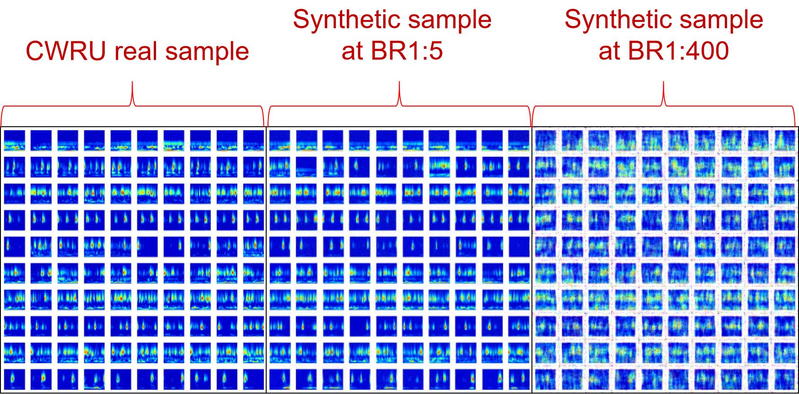
Fig.3 Result on CWRU dataset.

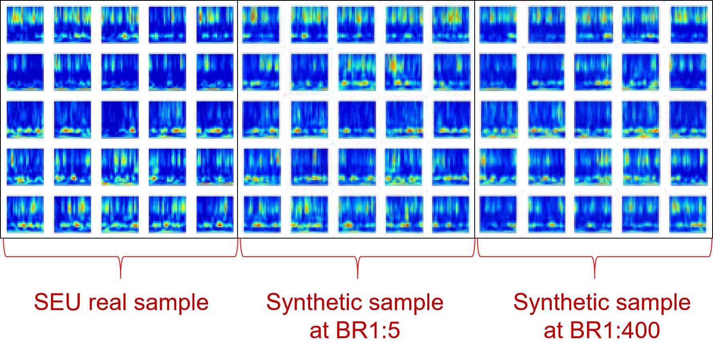
Fig.4 Result on SEU dataset.

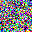
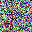
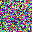
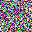
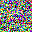
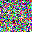
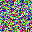
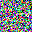
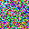
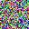

Fig.5 GIF of the inference synthesis process on the CWRU dataset at BR1:400.

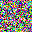
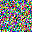
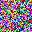
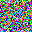
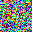

Fig.6 GIF of the inference synthesis process on the CWRU dataset at BR1:5.

Fig.7 GIF of the inference synthesis process on the SEU dataset at BR1:400.

Fig.8 GIF of the inference synthesis process on the SEU dataset at BR1:5.

## 8.Citation method of this paper repository
###
If your paper, research or project uses our research, please use this latex citation format:

@misc{SCQ-CFGRF,
  author = {Hongliang Dai, Dongjie Lin, Junpu He, Xinyu Fang, Siting Huang},
  title = {SCQ-CFGRF},
  year = {2025},
  publisher = {Zenodo},
  doi = {10.5281/zenodo.15083611},
  url = {(https://github.com/amstlldj/SCQ-CFGRF}
}

If you plagiarize our research, we will pursue legal action.

## 7.Contact us for cooperation or consultation
###
If you have any questions, please contact the author's work email or leave a message in issues. The author will try his best to answer them at his convenience.If you are interested in seeking cooperation, you can also consult this email.
Author contact email: 2112464120@e.gzhu.edu.cn
